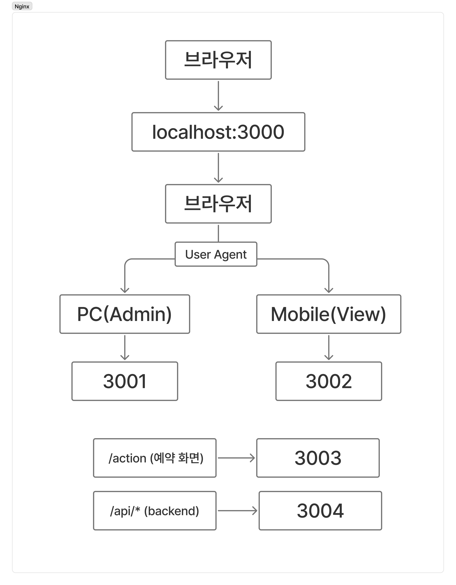
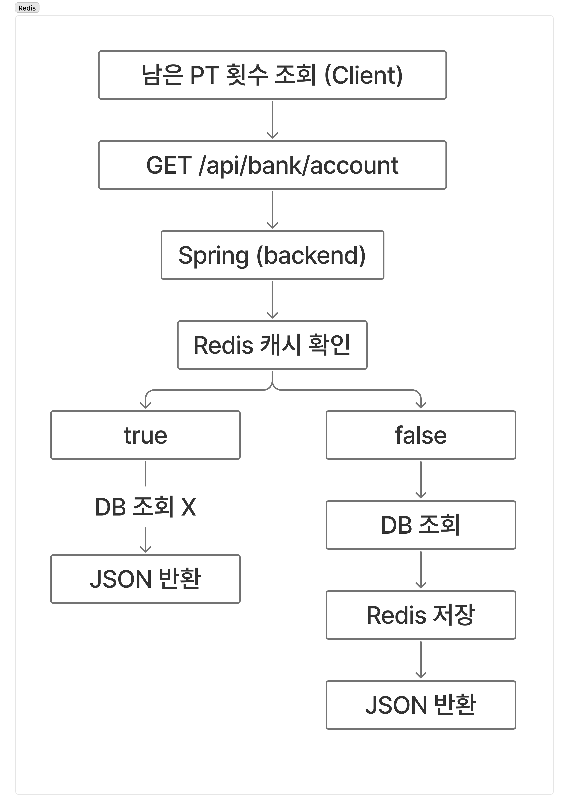
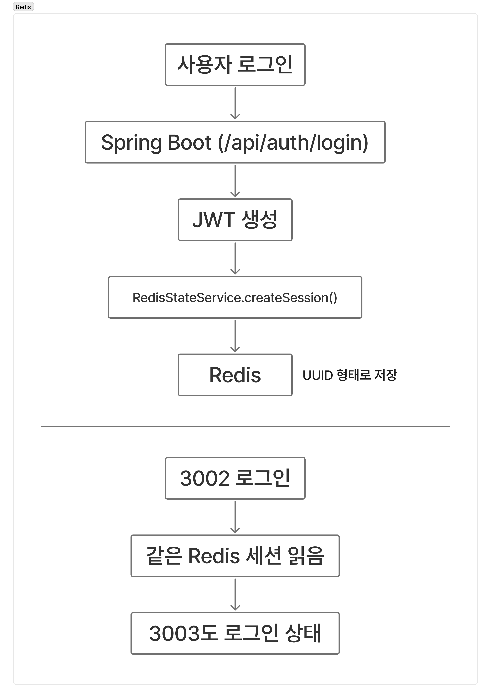
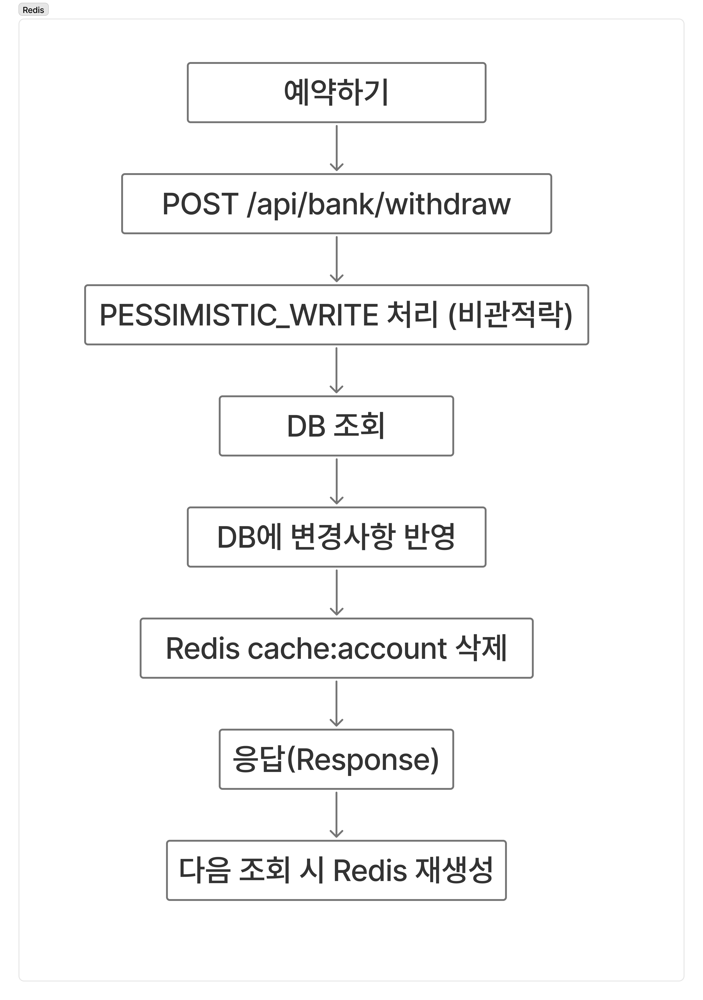

# 📱 PTTime - PT 예약 관리 시스템

PT 이용권 관리와 PT 예약을 위한 웹 서비스입니다.

사용자는 회원가입 및 로그인 후 PT 이용권을 조회하고 예약할 수 있으며, 이용권 충전 및 양도 기능을 사용할 수 있습니다.

관리자는 회원 관리, 이용권 관리, 예약 현황을 관리할 수 있으며 Redis 기반 세션 관리와 캐시를 이용하여 분산 환경에서도 동일한 로그인 상태와 빠른 조회 성능을 제공합니다.

---

# 🌐 Demo

```text
Local Environment

http://localhost:3000
```

---

# 📷 Nginx / Redis 흐름

| nginx 흐름             | redis 회원 생성 | redis 남은 횟수 조회 | redis 로그인 | redis 예약하기 |
|----------------------|-------------|----------------|-----------|------------|
|  |   | |  | |

---

# ⚙️ 실행 방법 (How to Run)

## 프로젝트 빌드

```bash
bash scripts/04-build-backend.sh
```

## 백엔드 실행

```bash
bash scripts/05-start-backend.sh
```

## 프론트 실행

```bash
bash scripts/07-start-next-servers.sh
```

## Nginx 실행

```bash
bash scripts/08-setup-nginx.sh
```

---

# 📌 프로젝트 개요

Redis 기반 분산 세션과 Nginx Reverse Proxy를 이용한 PT 예약 관리 시스템

---

## 주요 기능

* 회원가입
* 로그인
* Redis 기반 분산 세션
* PT 이용권 조회
* PT 예약
* 이용권 충전
* 이용권 양도
* 최근 예약 조회
* 예약 내역 조회
* 관리자 회원 관리
* 관리자 이용권 관리
* Redis 캐시 관리
* Redis 감사 로그

---

# 🛠 Tech Stack

## Front-End

* Next.js
* React
* JavaScript
* React Query
* Zustand

---

## Back-End

* Java 21
* Spring Boot
* Spring Security
* JWT

---

## Database

* MariaDB

---

## Cache

* Redis

---

## Infrastructure

* Nginx
* Docker
* Ubuntu
* GCP VM

---

## Build Tool

* Gradle

---

# 📂 Project Structure

```text
PTTime

├── frontend-admin
│
├── frontend-mobile-view
│
├── frontend-mobile-action
│
├── backend-spring-api
│
├── scripts
│
└── README.md
```

---

# 🏗 System Architecture

```text
                Browser
                   │
                   ▼
              Nginx (3000)
        ┌────────┼─────────┐
        ▼        ▼         ▼
 Admin 3001  View3002  Action3003
                 │
                 ▼
          Spring Boot API
               (3004)
                 │
       ┌─────────┴─────────┐
       ▼                   ▼
    MariaDB              Redis
```

---

# 🔄 Data Flow

## 로그인

```text
사용자

↓

로그인

↓

POST /api/auth/login

↓

Spring Security

↓

JWT 생성

↓

Redis Session 저장

↓

로그인 완료
```

---

## PT 이용권 조회

```text
모바일 조회(3002)

↓

GET /api/bank/account

↓

Redis Cache 확인

↓

Cache 존재

↓

즉시 반환

또는

Cache 없음

↓

MariaDB 조회

↓

Redis Cache 저장

↓

화면 출력
```

---

## PT 예약

```text
예약하기

↓

POST /api/bank/withdraw

↓

BankController

↓

BankService

↓

PESSIMISTIC_WRITE

↓

MariaDB 이용권 차감

↓

예약 내역 저장

↓

Redis Cache 삭제

↓

React Query invalidate

↓

GET /api/bank/account

↓

MariaDB 재조회

↓

Redis Cache 저장

↓

최신 이용권 표시
```

---

## 최근 예약

```text
예약 성공

↓

Redis List 저장

recent:recipients

↓

최근 예약 목록 조회
```

---

## 예약 내역

```text
모바일 조회(3002)

↓

GET /api/bank/transactions

↓

Spring Boot

↓

MariaDB Transaction 조회

↓

예약 내역 출력
```

---

# 🌐 Nginx Reverse Proxy

| Port | 역할              |
| ---- | --------------- |
| 3000 | Nginx           |
| 3001 | 관리자 화면          |
| 3002 | 모바일 조회          |
| 3003 | 모바일 예약          |
| 3004 | Spring Boot API |
| 3306 | MariaDB         |
| 6379 | Redis           |

---

# 🔌 URL Mapping

## Auth

| Method | URL                |
| ------ | ------------------ |
| POST   | /api/auth/login    |
| POST   | /api/auth/register |

---

## PT

| Method | URL                         |
| ------ | --------------------------- |
| GET    | /api/bank/account           |
| GET    | /api/bank/transactions      |
| GET    | /api/bank/recent-recipients |
| POST   | /api/bank/deposit           |
| POST   | /api/bank/withdraw          |
| POST   | /api/bank/transfer          |

---

## Admin

| Method | URL                            |
| ------ | ------------------------------ |
| GET    | /api/admin/dashboard           |
| POST   | /api/admin/users               |
| POST   | /api/admin/accounts            |
| PATCH  | /api/admin/users/{id}/password |
| PATCH  | /api/admin/users/{id}/status   |

---

# 🗄 Database

## users

* 회원 정보
* 로그인 정보
* 권한

---

## account

* PT 이용권
* 남은 이용권
* 상태

---

## transaction

* 이용권 충전
* PT 예약
* 이용권 양도
* 예약 내역

---

# 🔥 Redis

## Session

```text
auth:session:{sessionId}
```

로그인 세션 관리

---

## Account Cache

```text
cache:account:{userId}
```

PT 이용권 캐시

TTL : 30초

---

## Dashboard Cache

```text
cache:admin:dashboard
```

관리자 대시보드 캐시

---

## Recent Reservation

```text
recent:recipients:{userId}
```

최근 예약 목록

최대 10건

TTL : 7일

---

## Audit Log

```text
audit:logs
```

최근 예약 및 로그인 로그

---

# 🔒 동시성 제어

PT 예약 시 동일 이용권에 대해 동시에 여러 요청이 발생하는 것을 방지하기 위해 JPA의 **PESSIMISTIC_WRITE(비관적 락)** 을 적용하였다.

```text
예약

↓

PESSIMISTIC_WRITE

↓

이용권 Row Lock

↓

MariaDB 수정

↓

Lock 해제
```

이를 통해 중복 예약과 이용권 데이터 불일치를 방지하였다.

---

# ☁️ Deployment

* Ubuntu
* GCP VM
* Nginx Reverse Proxy
* MariaDB
* Redis
* Cloudflare Tunnel

---
# 🧠 Troubleshooting

## 1. 프론트엔드와 백엔드 API 연결 오류

### 문제

모바일 조회 화면(3002)에서 이용권 조회와 예약 내역을 불러오는 과정에서 `/api/bank/*` 요청이 404 오류를 반환하여 데이터가 표시되지 않았다.

### 원인

Next.js 프론트엔드에서 발생한 `/api/*` 요청이 Spring Boot API 서버(3004)로 정상 전달되지 않아 API를 찾을 수 없었다.

### 해결

- Spring Boot 서버가 정상 실행 중인지 확인하였다.
- `curl http://localhost:3004/api/health`로 API 서버 동작을 확인하였다.
- Nginx 및 프록시 설정을 점검하여 `/api/*` 요청이 3004번 포트로 전달되도록 수정하였다.

### 결과
- 프론트엔드와 백엔드가 정상적으로 연결되어 이용권 조회 및 예약 기능을 사용할 수 있도록 구성하였다.
---

# 🚀 Future Improvements

* 예약 캘린더
* 트레이너 관리
* 예약 취소
* 예약 알림
* QR 체크인
* 결제 시스템 연동
* AI PT 추천
* 예약 통계 Dashboard

---

# 📚 What I Learned

### Redis Session

Redis를 이용하여 여러 프론트엔드 서버가 동일한 로그인 세션을 공유하는 구조를 이해하였다.

---

### Redis Cache

PT 이용권 정보를 Redis에 캐싱하고 데이터 변경 시 Cache Eviction을 적용하는 방법을 학습하였다.

---

### Nginx Reverse Proxy

Nginx를 이용하여 하나의 도메인에서 여러 프론트엔드와 API 서버로 요청을 분산하는 구조를 이해하였다.

---

### PESSIMISTIC_WRITE

비관적 락을 적용하여 PT 예약 시 동시성 문제를 해결하고 데이터 무결성을 보장하는 방법을 학습하였다.

---

### React Query

예약 완료 후 invalidateQueries()를 이용하여 최신 데이터를 다시 조회하는 방식을 학습하였다.
