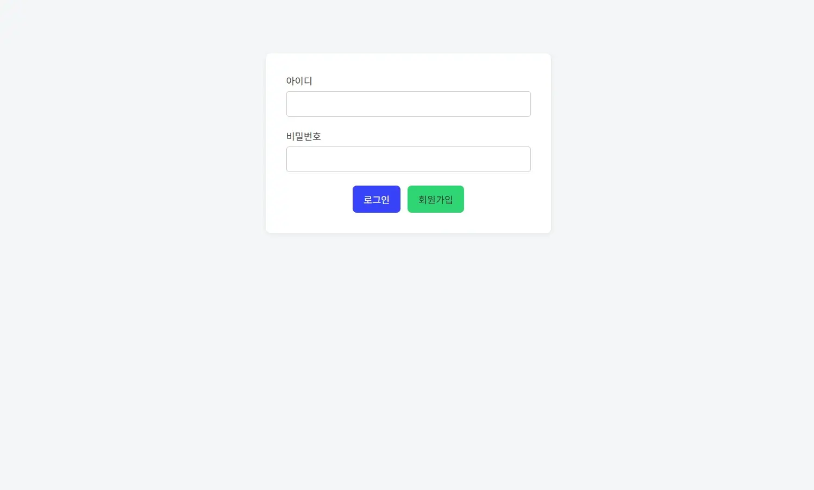
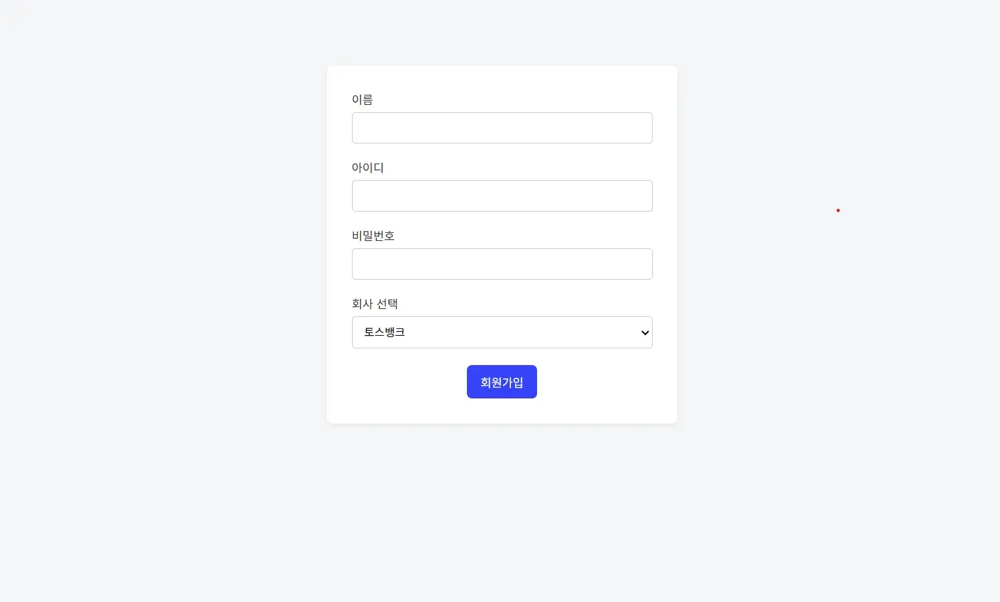
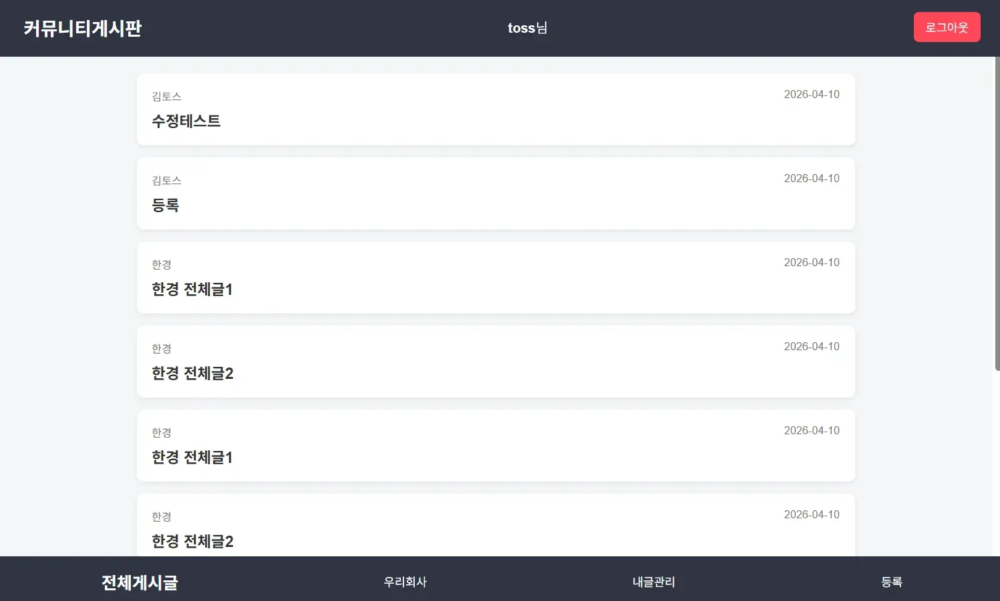
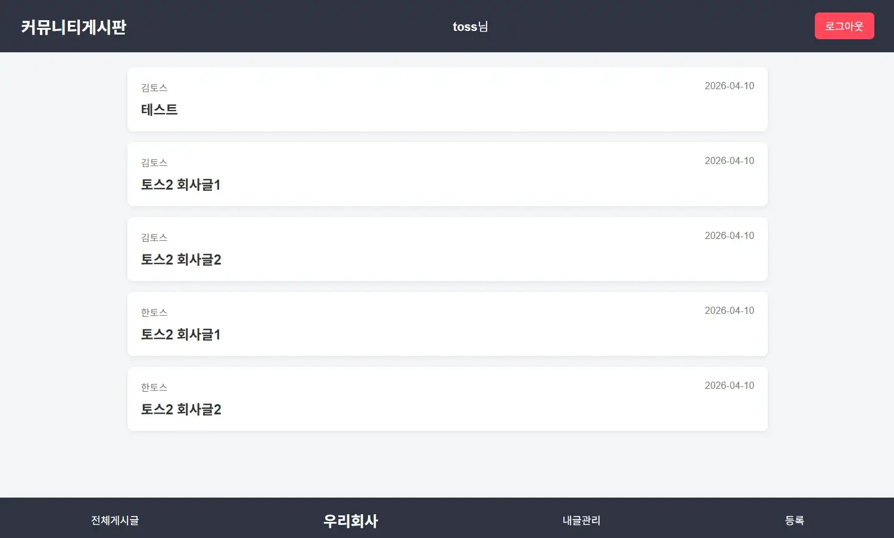
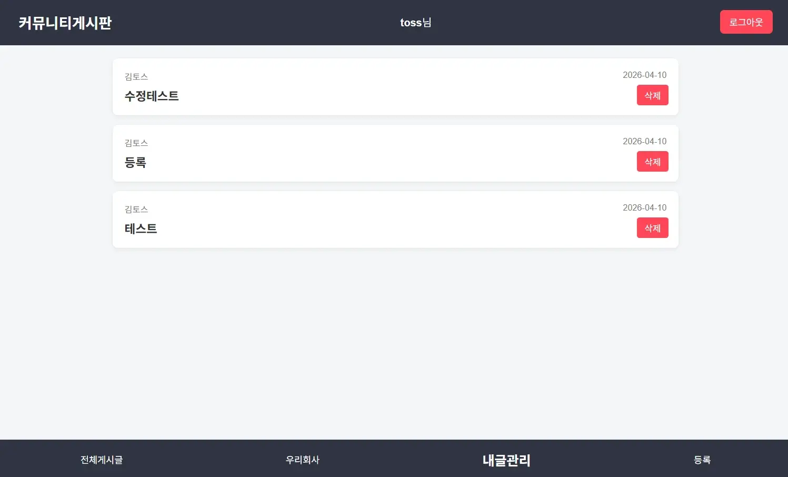
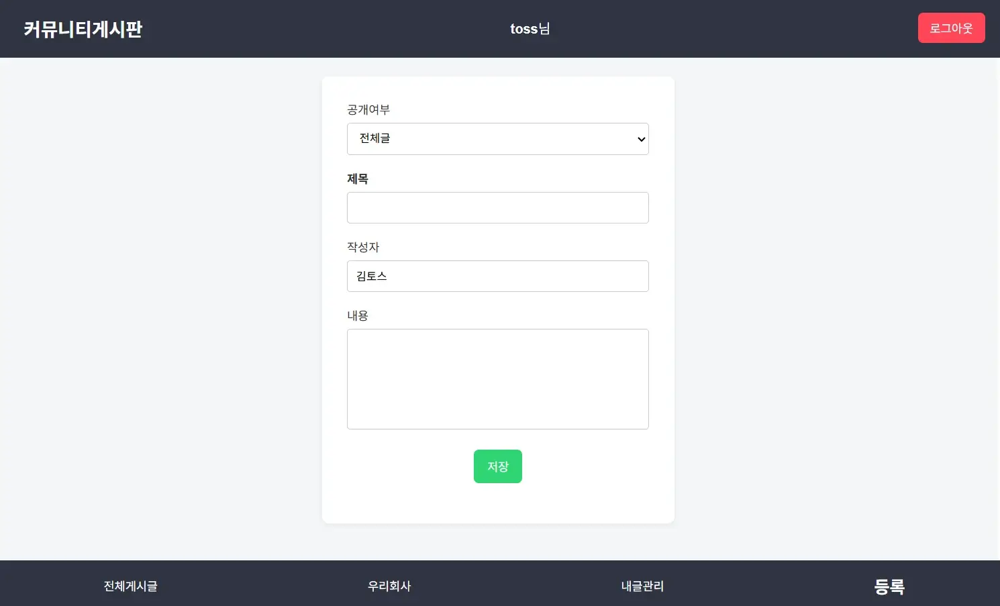
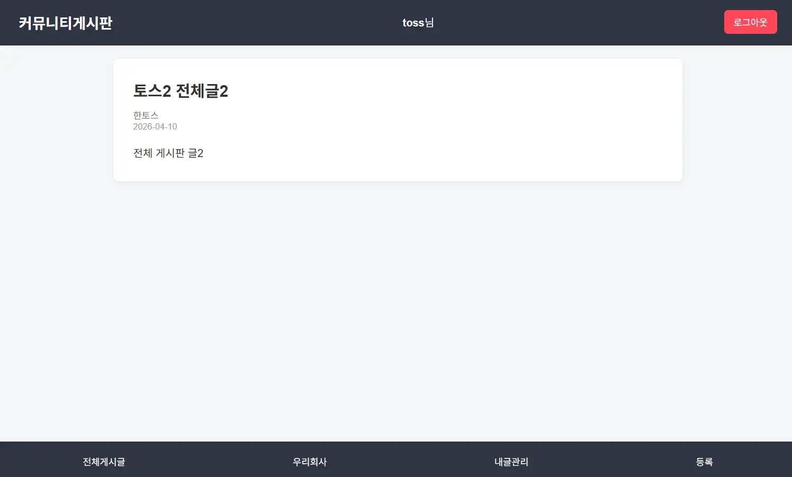
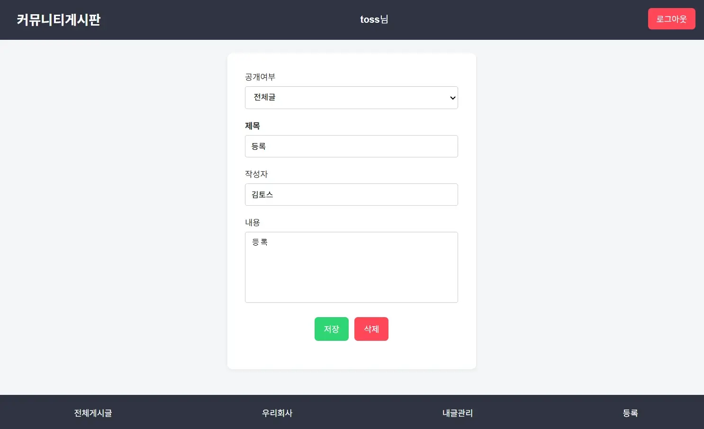

# 💼 직장인 커뮤니티 (Blind Clone Coding)

직장인을 위한 커뮤니티 서비스입니다.  
사용자는 로그인 후 **전체 게시판**과 **우리 회사 게시판**을 이용할 수 있으며  
게시글 **작성 / 조회 / 수정 / 삭제** 기능을 제공합니다.

회사 정보를 기반으로 **같은 회사 사용자들의 게시글만 볼 수 있는 게시판**을 구현했습니다.

---

# 🌐 Demo

배포 주소  
Cloudflare + GCP

```
https://plugins-student-dressing-ids.trycloudflare.com/
```

---

# 📷 Screenshots

프로젝트 실행 화면

| 로그인 | 회원가입 | 전체 게시판 | 우리회사글 | 내글관리 | 등록 | 상세 | 수정 |
|---|---|---|---|---|---|---|---|
|  |  |  |  |  |  |  |  |


---

# ⚙️ 실행 방법 (How to Run)

```bash
npm install
node server.js
```

---

# 📌 프로젝트 개요

직장인 커뮤니티 서비스 구현 프로젝트

### 주요 기능

- 회원가입
- 로그인 (JWT 인증)
- 전체 게시판 조회
- 우리 회사 게시판 조회
- 게시글 작성
- 게시글 수정
- 게시글 삭제
- 내가 작성한 게시글 조회
- 로그인 인증 검증

---

# 🛠 Tech Stack

## Front-End

- HTML
- CSS
- JavaScript

## Back-End

- Node.js

## Database

- MariaDB

## Auth

- JWT (JSON Web Token)

## Infra

- GCP
- Cloudflare

---

# 📂 Project Structure

```
board
├── public
│   ├── static
│   │   ├── auth.js
│   │   └── style.css
│   └── templates
│       ├── board.html
│       ├── company.html
│       ├── detail.html
│       ├── edit.html
│       ├── login.html
│       ├── mypage.html
│       ├── signup.html
│       └── write.html
├── screenshots
├── members.sql
├── server.js
├── README.md
├── workflow.md
```

---

# 🏗 System Architecture

```
Browser (Client)
        │
        ▼
HTML / CSS / JavaScript
        │
        ▼
Node.js Server (server.js)
        │
        ▼
MariaDB Database
        │
        ▼
JSON Response
        │
        ▼
Browser Rendering
```

---

# 🔐 Authentication Flow (JWT)

```
사용자 로그인
      │
      ▼
서버에서 JWT 토큰 생성
      │
      ▼
LocalStorage 저장
      │
      ▼
API 요청시 Authorization Header 전달
      │
      ▼
서버에서 토큰 검증
      │
      ▼
API 데이터 반환
```

토큰 검증 로직은 **auth.js 공통 스크립트**로 분리하여 관리

---

# 🔄 Data Flow

```
User Input
   │
   ▼
HTML Event
   │
   ▼
JavaScript Fetch Request
   │
   ▼
Node.js API (server.js)
   │
   ▼
MariaDB Query
   │
   ▼
JSON Response
   │
   ▼
UI Rendering
```

---

# 🔌 API Routes

## Auth

| Method | Endpoint | Description |
|------|------|------|
| POST | /api/signup | 회원가입 |
| POST | /api/login | 로그인 |
| GET | /api/verify | 토큰 검증 |

---

## Board

| Method | Endpoint | Description |
|------|------|------|
| GET | /api/list | 전체 게시글 조회 |
| GET | /api/detail/:id | 게시글 상세 조회 |
| POST | /api/write | 게시글 작성 |
| GET | /api/edit/:id | 수정할 게시글 조회 |
| PUT | /api/edit/:id | 게시글 수정 |
| DELETE | /api/delete/:id | 게시글 삭제 |

---

## User

| Method | Endpoint | Description |
|------|------|------|
| GET | /api/data/:userId | 내가 작성한 게시글 조회 |

---

## Company

| Method | Endpoint | Description |
|------|------|------|
| GET | /api/company/:company | 같은 회사 게시글 조회 |

---

# 🗄 Database Design

## members

| column | description |
|---|---|
| id | PK |
| user_id | 로그인 아이디 |
| user_pwd | 암호화 비밀번호 |
| name | 사용자 이름 |
| company | 회사 |

user_id는 **UNIQUE 설정**으로 중복 가입 방지

---

## board

| column | description |
|---|---|
| id | PK |
| user_id | 작성자 |
| title | 제목 |
| content | 내용 |
| date | 작성일 |
| type | 게시판 타입 |

---

# 🧾 주요 SQL

## 특정 사용자 게시글 조회

```sql
SELECT *
FROM board
WHERE user_id = ?;
```

## 같은 회사 사용자 게시글 조회

```sql
SELECT b.*
FROM board b
JOIN members m ON b.user_id = m.user_id
WHERE b.type='company'
AND m.company = ?;
```

members 테이블과 board 테이블을 **JOIN**하여  
같은 회사 사용자 게시글만 조회


---

# 🧠 Troubleshooting

### JWT 인증 문제

로그인 후 API 호출 시 인증 오류 발생

원인  
토큰 검증 로직을 필요한 페이지마다 넣어주다보면 누락되는 페이지에서 에러 발생

해결  
공통 인증 스크립트 **auth.js**로 분리

---

### 게시글 삭제 오류

DELETE 요청 시 id 전달 문제 발생

원인  
쿼리 파라미터 설정 오류

해결  
요청 파라미터 수정 후 정상 동작

---

# 🚀 Future Improvements

- 댓글 기능
- 좋아요 기능
- 게시글 페이징
- 무한 스크롤
- 이미지 업로드
- 알림 기능

---

# 📚 What I Learned

- JWT 기반 인증 처리 구조 이해
- REST API 기반 CRUD 설계
- SQL JOIN을 활용한 데이터 조회
- Node.js 서버 구조 이해

---

# 📄 Page Pipeline

## signup.html

1 데이터 로딩  
회원가입 입력 폼 렌더링

2 데이터 수집  
입력 값 수집

3 데이터 처리  
회원가입 요청 → 비밀번호 암호화 → DB 저장

---

## login.html

1 데이터 로딩  
로그인 화면 표시

2 데이터 수집  
아이디 / 비밀번호 입력

3 데이터 처리  
로그인 요청 → 비밀번호 비교 → JWT 발급

---

## board.html

1 데이터 로딩  
로그인 인증 확인  
전체 게시글 조회

2 데이터 수집  
게시글 선택

3 데이터 처리  
상세 페이지 이동

---

## detail.html

1 데이터 로딩  
게시글 상세 조회

2 데이터 수집  
작성자 확인

3 데이터 처리  
본인 글일 경우 수정 / 삭제 가능

---

## edit.html

1 데이터 로딩  
게시글 데이터 조회

2 데이터 수집  
수정 내용 입력

3 데이터 처리  
PUT 요청으로 수정

---

## write.html

1 데이터 로딩  
작성자 정보 표시

2 데이터 수집  
제목 / 내용 입력

3 데이터 처리  
게시글 등록

---

## mypage.html

1 데이터 로딩  
내 게시글 조회

2 데이터 수집  
수정 / 삭제 선택

3 데이터 처리  
게시글 수정 / 삭제

---

## company.html

1 데이터 로딩  
같은 회사 게시글 조회

2 데이터 수집  
게시글 선택

3 데이터 처리  
상세 페이지 이동
